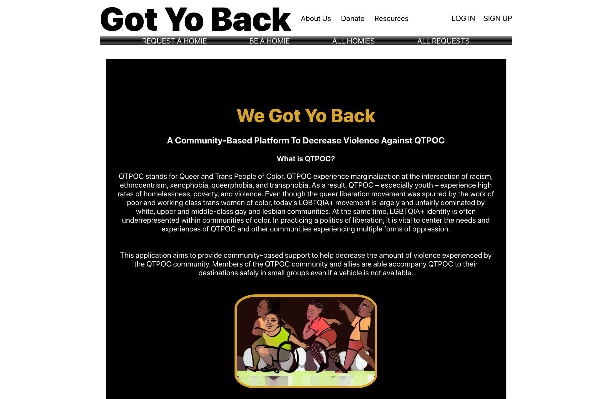
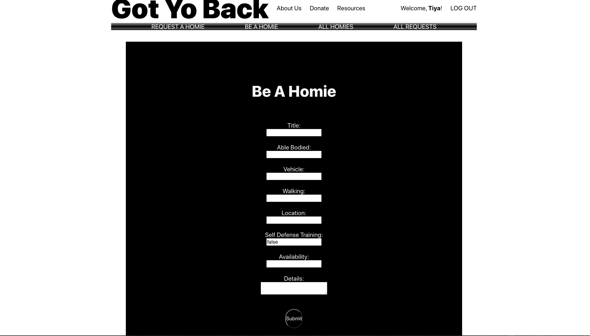
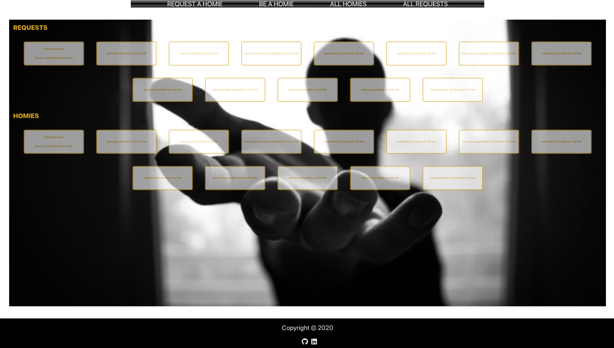

# Got Yo Back 
### GA: React SPA 

#### About the App
QTPOC stands for Queer and Trans People of Color. QTPOC experience marginalization at the intersection of racism, ethnocentrism, xenophobia, queerphobia, and transphobia. As a result, QTPOC – especially youth – experience high rates of homelessness, poverty, and violence. 

This application aims to provide community-based support to help decrease the amount of violence experienced by the QTPOC community. Members of the QTPOC community and allies are able accompany QTPOC to their destinations safely in small groups even if a vehicle is not available.

## Technologies: 

```bash
MERN-stack: MongoDB/Mongoose, Express, React, Node
```

## Features: 

This app is a community-based communication app. It provides the following features:
Resources and information about the rationale of the app, a description of the app, and a donation page.
The app contains restricted features for signed in users(token based) incuding creating, editing, deleting and displaying posts to request and/or be a homie. 

Access to creator's LI and GH handles provided at bottom of home page. 

## Images of working app

###About Us Page:


### Form:


###Landing Page:


## Getting Started
Explore information and resources about the app on the landing page.
View posts on main page.
Sign up or login to create posts. 

https://got-yo-back-p3.herokuapp.com/

## Trello board
https://trello.com/b/Z4rg1igd/gyb

## Unsolved Problems: 
Edit function for Requests

## Stretch Goals/Future Goals:
* Add an admin entity with features including block users, approve users, full CRUD on all posts
* Implement live chat 
* No whitespace, clean up code, better organzation, improve on naming conventions
* Use of more materialize styling options and some tool tips
* Consume Google maps live tracking API so users can drop pin
* Add color flag to each post based on the level of danger and add dropdown to select level
* Add logic to track number of QTPOC community getting home safely when using app. 
* Make my app responsive
* Transition into React Native app for functionality

